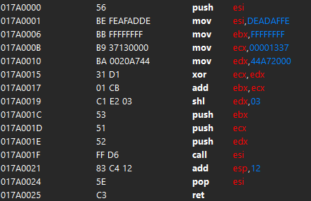
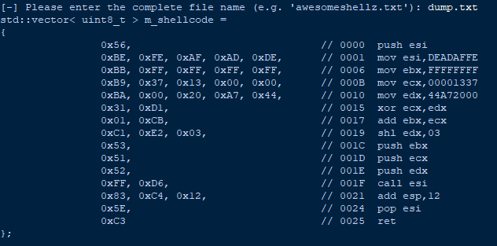
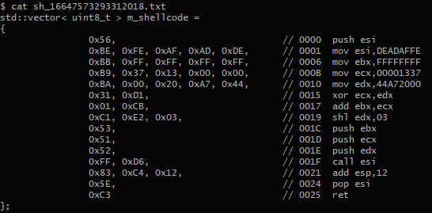

# **C**heat-**E**ngine-**A**ssembly-**D**ump-**T**o-**S**hellcode-**C**onverter (**CEADTSC**)

## Is writing your own shellcode annoying? Do you spend quite some time converting your assembly to C++ syntax?
## **Well say no more! CEADTSC is here to help you!**
---
## You will generate your c++ copy+paste ready shellcode quicker, than saying **Cheat-Engine-Assembly-Dump-To-Shellcode-Converter** out loud!
- Tested on Python 3.10 and 3.9
---
## Usage:
- Dump shellcode from Cheat Engine (**Bytes+Opcodes**) and save it in a file
  - 
  - 
- start CEADTSC.py
- enter the file name, which contains the dump from cheat engine
  - 
- enjoy your new file **sh_{timestamp}.txt**, which will contain the copy+paste ready generated shellcode
  -  

### Yes, I was so fuckin' annoyed doing this converting shit myself I wrote this simple python program for it. Don't bother me with proper code guidelines in this one here, thank you. 